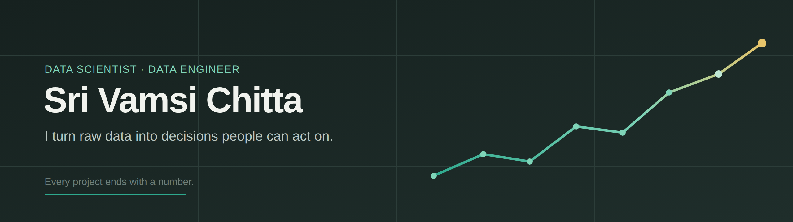

### Data Scientist · ML & AI  Engineer &nbsp;|&nbsp; Remote · US

I build the unglamorous parts of data science well: the pipelines that don't
break, the models that hold up in production, and the docs that let the next
person run it. Currently a Data Scientist at **Capital One**, finishing an
**MS in Data Science** at the University of North Dakota.

My one rule: **every project ends with a number.** Here are some of them.

 

## 📊 Results

| Outcome | Project | What it took |
| :-- | :-- | :-- |
| **−45%** false alarms | Real-time IoT anomaly detection | LSTM · AWS · Docker |
| **94%** F1 score | Ransomware classification at scale | XGBoost · SVM · feature pipeline |
| **0.89** R² | Student performance predictor (deployed) | Ensembles · Streamlit · REST |
| **10K+** records | Thyroid cancer risk analytics | Python ETL · Tableau |
| **12/12** tests passing | Production ETL pipeline *(live below)* | Pandas · SQLite · pytest |

 

## 🔧 Currently building

- **[etl-pipeline-python](https://github.com/Srivamsi9398/etl-pipeline-python)** — a production-shaped ETL pipeline: live USGS API → Pandas → SQLite with incremental upserts, structured logging, offline fallback, and a full test suite. *Not a notebook — structured, logged, and tested the way I'd ship it.*
- **Portfolio site** — a metrics-forward personal site (in this profile's repos).
- **SQL portfolio** — interview-grade query problems with explained solutions. *In progress.*

 

## 💼 Experience

**Data Scientist** — Capital One *(Contract)* · `Mar 2025 – Present` · Remote
> Analyze financial transaction data to surface spending and income patterns for
> classification use cases. Clean and standardize merchant and transaction
> descriptions to lift data quality and model reliability.

**System Engineer** — Infosys · `May 2022 – Jun 2024` · Hyderabad, India
> Built an end-to-end machine learning system for retail demand forecasting and
> inventory optimization. Delivered production data systems used by downstream
> teams. *(Started as a System Engineer Trainee — Core Java & SQL.)*

**Machine Learning Engineer** — Magneq Software · `Jan 2021 – Dec 2021` · India
> Built a fraud-detection pipeline on highly imbalanced transaction data.
> Engineered features from transaction history and evaluated classification and
> anomaly-detection models.

 

## 🧰 Toolbox

| Layer | Tools |
| :-- | :-- |
| **Languages** | Python · SQL · Java · R |
| **Data & ETL** | Pandas · NumPy · SQLAlchemy · ETL/ELT design |
| **Databases** | PostgreSQL · MySQL · SQL Server · Snowflake |
| **ML / Modeling** | scikit-learn · PyTorch · XGBoost · LightGBM · TensorFlow |
| **Cloud & Deploy** | AWS (S3, SageMaker, EC2) · Docker · MLflow · Streamlit |
| **BI & Viz** | Tableau · Power BI · Matplotlib · Seaborn · Plotly |
| **Ways of working** | Git & PR review · reproducible workflows · AI-assisted development |

 

## 🎓 Education

**MS, Data Science** — University of North Dakota · `Aug 2024 – May 2026`
 
**B Tech, EEE** — Ramachandra College of Engineering · `Jun 2016 – Sep 2020`
 

## 📫 Reach me

Built to be used, not to impress.
